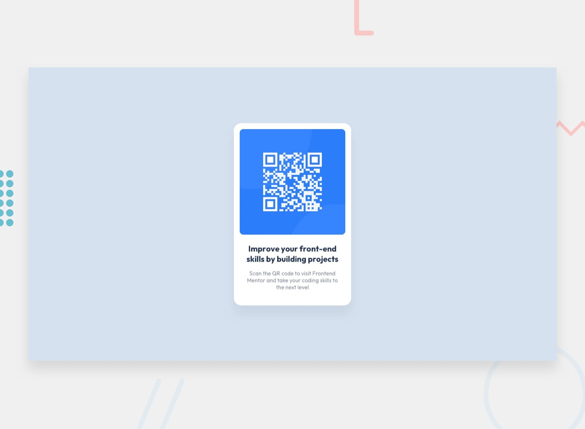

# Frontend Mentor - QR code component solution

This is a solution to the [QR code component challenge on Frontend Mentor](https://www.frontendmentor.io/challenges/qr-code-component-iux_sIO_H). Frontend Mentor challenges help you improve your coding skills by building realistic projects. 

## Table of contents

- [Overview](#overview)
  - [Design](#design)
  - [Links](#links)
- [Author](#author)

## Overview

### Design

### Links

- Solution URL: [Solution URL](https://www.frontendmentor.io/solutions/qr-code-component-4BsDe4QGnm)
- Live Site URL: [Live Site URL](https://liam-mcleod.github.io/FrontendMentor-QR-Code-Component/)

## Author
- Frontend Mentor - [@Liam-McLeod](https://www.frontendmentor.io/profile/Liam-McLeod)
